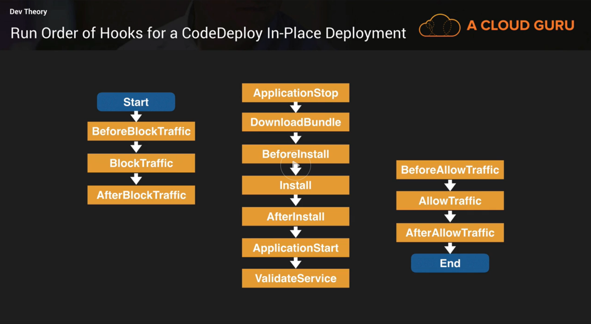

# acloudguru-aws-cda
Study Notes From https://acloud.guru Certified Developer Associate Course

Released June 2018

Can Skip
 - IAM
 - EC2
 - Parts of Chapter 5 (serverless, alexa)

## Exam Blue Print
  - Scoring - 100-1000, min passing 720
      - Deployment - 22%
      - Security - 26%
      - Development w/ AWS Services - 30%
      - Refactoring - 10%
      - Monitoring and Troubleshooting - 12%
  - Length - 120 Minutes, 65 Questions
  - Cost - $150USD

## White Papers
  - Understand Blue/Green Deployments

## Exam Tips  
  - Always use roles over having secret access key/secret

## IAM
  - Users - real people
  - Groups - collection of users
  - Roles - assignable to resources
  - Policy - defines permissions (JSON), can be attached to users groups and roles

username/password are used to log into the web console
accesskey/secretaccesskey - programatic access

### iam exam tips
  - IAM is universal
  - Root account - email you registered with
  - New users have **NO PERMISSIONS** by default
  - Know how to read JSON policies going into exam

## EC2 - Elastic Cloud Compute
Scale Up - Bigger/Beefier (quality) boxes
Scale Out - Get more (quantity) boxes
user data - bootstrap scripts for EC2 instances, run at root level
ec2-user - default user on ec2 instance
roles can be applied while ec2 instance running, they are applied immidiately

- Pricing Options
  - On Demand
  - Reserved - contract 1 or 3 years
    - Standard
    - Convertible
    - Scheduled
  - Spot - bid pricing
  - dedicated hosts - physical machine dedicated to you

  Instance Types
  F - field programable gate array
  I - high speed storage
  G - graphics
  H - high throughput
  T - lowest cost (cheap)
  D - dense storage
  R - ram
  M - main choice
  C - compute optimized
  P - gPu
  X - xtreme memory

  ### EBS - Elastic Block Storage
  Disk in the cloud, attachable to EC2
  Root volume is where OS installed

  Types
  - General Purpose - balance price + performance, <= 10,000IOPS
  - Provisioned IOPS - relational dbs, > 10,000IOPS
  - Throughput Optimized - big data, log processing, not boot volumes
  - Cold HDD - Lowest cost, think file server
  - Magnetic - legacy, lowest cost of bootable types

  Create a volume from encrypted snapshot, the volume will be encrypted
  Create a volume from an unencrypted snapshot, the volume will be unencrypted
  You can created encryted volumes
  root device volume can be encrypted by an OS level application, or creating a snapshot -> create a copy of the snapshot and select encrypt -> create image
  **ebs volume has to be in same az as ec2 instance**

### ELB - Elastic Load Balancer
 - Application Load Balancer - Layer 7 - HTTP/S routing, URL matching/routing
 - Network Load Balancer - Layer 4 - Latency, extreme performance
 - Classic Load Balancer - Layer 4 & 7 - HTTP/S, TCP, sticky sessions

 You can have multiple SSL certs per application load balancer

### Elastic Beanstalk
Higher level package for EC2, ELB, Auto Scaling
Deploy Code, set & forget

#### Updating EB
Types
  - All at once - downtime, all instances simultaneously
  - Rolling - deploys in batches
  - Rolling with additional batch - maintains full Capacity (make new ec2)
  - Immutable - basically creates full fleet of new instances

#### Advanced EB
All done in **.ebextensions** folder, top level directory (yaml or json)
files have **.config** extension

#### EB + RDS
Deleting Environment will delete RDS (advised to decouple these)

### Route53
AWS DNS service
Alias record - points to AWS resources
Naked domain - aka Apex record - domain.com (no www)

### RDS - Relational Database Service
DBs available
 - MSSQL
 - ORACLE
 - MySQL
 - PostgreSQL
 - Amazon Aurora - Compatible with MySQL and PostgreSQL
 - MariaDB

Types of Backups
1. Automated Backups - Point In Time (1-35 days) - daily backup with transaction logs during the day (1 second) - enabled by default
1. Snapshot - Always done manually

To Encrypt an Existing DB you must create a snapshot, then make a copy with the encryption setting set.

Multi AZ - Disaster Recovery
Read Replica - Performance

 OLTP vs OLAP
 OLTP - Online Transaction Processing - Pulls up a row of data (simple, frequent)
 OLAP - Online Analytics Processing - running aggregate queries (complex, infrequent)

 #### Working w/ RDS
  - when initially creating RDS instance you provide server identifier, db name, username, password
  - always given dns address as endpoint
  - port 3306 is sql port
  - make sure you open up ports in SGs

 ### Non-Relational Databases
 Don't have to define schema ahead of time
  - DynamoDB

 ### Data Warehousing
  - Redshift - OLAP

### DynamoDB
NoSQL db with single digit millisecond latency. fully managed
no database schema upfront
SSD storage
3 az by default
eventual (default) or strongly consistent reads
Primary Keys
 - Partition Key
 - Composite Key (Partition Key + Sort Key)
Supported document formats
 - JSON
 - HTML
 - XML
Fine Grain control using IAM condition parameter **dynamodb:LeadingKeys** to match partition key value to some security attribute

#### Advanced Index
Local Secondary Index
 - can only be created when creating table
 - same partition key different sort key
Global Secondary Index
 - can be added later
 - different partition + sort key

#### Scan vs Query
Query - By Primary Key and optional sort key, results always sorted by sort key, ascending order, reverse order by setting **ScanIndexFoward** (yes on query op, not typo) to false. Queries by default eventually consistent.
scan - examine all items in a table
query more efficient than scan
scan dumps table, then filters data
by default all data attributes are returned, if you want specifics use the **ProjectionExpression**

#### Provisioned Throughput
Measured in Capacity Units (Read & Write)
1 WCU - 1 x 1KB Write/Sec
1 RCU - [1 x 4KB Strongly Consistent Read/Sec] or [2 x 4KB Eventually Consistent Read/Sec (default)]
**must round up for calculations**

#### DynamoDB Accelerator (DAX)
In-memory cache for DynamoDB
Only works for **reads**
Delivers up to 10x read performances
Caters to **eventually consistent reads**, not strongly consistent

### Elasticache
Offload performance from EC2 or common DB queries that don't change often
good if db is **read heavy** and **doesnt change frequently**
 Types
  - Memcached - no replication, simple, scale out, no multi-az
  - Redis - multi AZ w/ failover, sorting/ranking, pub/sub, data persistence
Strategies
  - Lazy Loading - load data into cache only when necessary
  - Write through - add/update data to cache whnever data is written into db
TTL - Time to Live - number of seconds until the data expires

### KMS - Key Management Service
Managed service for encryption keys
encryption keys for kms are **regional**
CMK - Customer Master Key
  - key material (customer or aws provided)
  - can never be exported
define **administrative** and **usage** permissions

#### KMS API Calls
**must know the following**
aws kms encrypt
aws kms decrypt
aws kms re-encrypt
aws kms enable-key-rotation

#### Envelope Encryption
Encrypt the Key
CMS used to decrypt data key (envelope key)
Envelope Key used to decrypt the data

### SQS
Distributed Message Queue System (Pull)
Up to 256KB of text
pull based
kept up-to 14 days, default 4 days
visibility timeout 30sec default, max 12 hrs
long poll & short poll
types
  - standard - no order, possible to deliver multiple times
  - fifo - order preserved, 300 transaction/sec
ChangeMessageVisibility - API call to set length of time
max long poll timeout - 20 sec

### SNS
Pub/Sub System (Push)

### SES - Simple Email Service
Can be used to receive

### Kinesis
Steaming data (kilobytes)
stored for 24hr (default) / up to 7d
services
  - streams - stored in shards
  - firehose - higher level (no shards)
  - analytics - sql query analyze data

### CLI - Command Line Interface
- Give users **least privilege** - minimum amount of access required
- Create groups, then assign users to groups

  ### EC2 Exam Tips
  - If spot instance is terminated by amazon, you will **not** be charged for a partial hower. However if you termate the instance yourself, you will be charged for the **complete** hour in which the instance ran
  - Remember FIGHTDRMCPX
  - Remember EBS types and what they are used for
  - always use roles over access keys

## S3 - Simple Storage Service
Object Storage
File Size - **0 Bytes** to 5TB, **single PUT request 5GB**
Unlimited Storage Capacity
S3 namespace is **universal** (https://<region>.amazonaws.com/<bucketname>)

Data Consistency
  - Read after write consistency for PUTS (creates)
  - Eventual Consistency for overwrite PUTS and DELETES

99.99% available (designed), 99.9% guaranteed
99.999999999% durable (11 x 9s)

### Performance
100 PUT/LIST/DELETE
<= 300 GET
if going over these limits use Cloudfront / Transfer acceleration
**prefix with random key names - for better IO**
**Update** 3,500 PUTS/sec, 5,500 GETS/sec meaning previous random guidance is not applicable. July 2018 Test - Possibly still using old  values. Just be aware.

### Security
- By default, all newly created buckets are **private**
- access
    - Bucket policy (JSON) - bucket level
    - Access Control List - object level
- can be configured to create access logs

### Encryption
- Encryption in Transit (SSL/TLS)
- At Rest
    1. SSE-S3 - S3 Managed Keys
    1. S3-KMS - AWS key management service
    1. SSE-C - Server side encryption with Customer Provided Keys
    1. Client Side Encryption (Encrypt before uploading)

Headers
  - x-amz-server-side-encryption
      - AES256 (SSE-S3)
      - ams:kms (SSE-KMS)

you can enforce only encrypted objects be stored by making a bucket policy to deny any PUTS w/o the header

### Tiered Storage
  - S3 - 99.99% avail, 11 x 9s durable, loss of 2 facilities
  - S3 - IA (Infrequently accessed)
  - S3 - 1 zone IA - same as IA, only 99.5% avail. Cost 20% less than regular S3 - IA
  - Reduced Redundancy storage 99.99% durable and avail - for easily reproducible data - going to be phased out, no longer recommended by aws
  - * Glacier - not really S3, but used for archives (3-5 hour retrieval)

### CORS
Must be using s3 website url
https://<bucketname>.s3-website.<region>.amazonaws.com

Lifecycle Management - surprisingly wasn't touched on in this course

### S3 Exam Tips
**Not for OS or databases**
Universal namespace
Read S3 FAQ

### Cloudfront
CDN - Content Delivery Network
Geographically distributed users
Cloudfront - Faster Downloads
S3 Transfer Acceleration - Faster Uploads
Key Terminology
  - Edge Location - where object is cached
  - Origin - S3 Bucket, EC2 instance, ELB, Route53
  - Distribution - network of edge locations
    - Web Distribution (websites)
    - RTMP (Real Time Messaging Protocol) - Media Streaming

## Serverless

### Lambda
Under the Compute Services
Event (trigger) driven compute service
Supported Languages:
  - Node.js
  - Java
  - Python
  - C#
  - Go

#### Lambda Version Control
Each lambda version has a unique arn and is **immutable**
qualified arn - has version or **$LATEST** at the end
unqualified arn - does not have version
versioning can be use to do splits between traffic
  - cannot split traffic to $latest, must first make alias to $latest and route traffic to alias

#### Lambda Exam Tips
- Scales out, not up
- Functions are independent, 1 event = 1 Function
- lambda is serverless
- know which services are support serverless
    - api gateway
    - Lambda
    - s3
    - DynamoDB
- functions can trigger other functions
- debug lambda - aws xray
- lambda can be used global resources, but live in a region
- know triggers!
    - API Gateway
    - AWS IOT
    - alexa skills kit
    - alexa smart home
    - cloudfront
    - cloudwatch events
    - cloudwatch logs
    - code commit
    - cognito sync trigger
    - DynamoDB
    - kinesis
    - s3
    - sns

### API Gateway
Features
  - Scaling
  - Throttling
  - API Key
  - CORS
API caching - caching path responses for a ttl
you can import apis from swagger files

#### Advanced
Can create / update apis using swagger
API throttling 10,000 requests per second / 5000 concurrent requests per second
can configure as SOAP passthrough

### Step Functions
Visual and Test Serverlesss Applications

### X-Ray
Collects data about applications
Interceptors - trace http requests
client handlers - instrument application and other aws services
http client - instrument call to other http services
xray supports all lambda languages
 - java
 - go
 - nodejs
 - python
 - ruby
 - .net
integrates with
 - elb
 - lambda
 - api gateway
 - ec2
 - beanstalk

### CI (Continuous Integration)/ CD (Continuous Delivery/Deployment)
Continuous Delivery - changes auto built/test but manual decision to deploy
Continuous Deployment - Continuous Delivery + Auto Deploy when passing all tests
**read practicing continuous integration continuous delivery on aws white paper**
CodeCommit - git
CodeBuild - build system
CodeDeploy - deploy agent
CodePipeline - gui tool for CI/CD - automat end-to-end release process

#### CodeDeploy
Deployment Approaches
  - In-Place - aka "Rolling Update", not supported in lambda, rollback requires rollback deployment
  - Blue/Green - change in elb setting, instant rollback and deploy
Terminology
  - Deployment Group - EC2 instances/Lambda functions to deploy to
  - Deployment - process of applying new revision
  - Deployment configuration - rules how to deploy, success and failure conditions
  - AppSpecFile - actions CodeDeploy to execute
  - Revision - Required files to deploy new version (appspec, app files, executables, config)
  - Application - unique id for app to deploy

##### Advanced Code Deploy
AppSpec defines parameters for CodeDeploy Deployment
Structure depends on use
  - lambda - version, resources, hooks, written in YAML or JSON
    - BeforeAllowTraffic
    - AfterAllowTraffic
  - ec2 - version, os, files, hooks, appspec.yml must be placed in **root directory**
    - BeforeBlockTraffic - run task on instance before deregistered ELB
    - BlockTraffic - deregister
    - AfterBlockTraffic - run tasks on instance after deregistered from ELB
    - ApplicationStop - Gracefully stop application
    - Download bundle - CodeDeploy download app to temp location
    - BeforeInstall - time to backup current files
    - Install - CodeDeploy overwrites application with new revision
    - AfterInstall - post installation scripts (e.g. configuration task, file permissions)
    - ApplicationStart - Restart services
    - ValidateService - Any tests
    - BeforeAllowTraffic
    - AllowTraffic
    - AfterAllowTraffic

These are defined as the **"run order of hooks"**

#### CodePipeline
Use S3 versioning when using CodePipeline

#### CodeBuild
You can use a buildspec.yml in the root of source code directory or specify/override it in CodeBuild itself

##### Docker
_This is not AWS, but these commands will be on the test_

`docker build -t mydockerrepo .`

`docker tag mydockerrepo:latest remote/repo:lastest`

`docker push remote/repo:lastest`

### CloudFormation
Infrastructure as Code (YAML or JSON)
**Resources** only mandatory section
**Transform** reference code outside cloudformation template file
sections of template
  - parameters
  - conditions
  - resources
  - mappings
  - transforms
  - outputs

#### Serverless Application Model (SAM)
Extension to CloudFormation
Simplified Syntax for APIs, Lambda Function, DynamoDB tables ect
has own cli - sam cli
  - `sam package` - package application and upload to S3
  - `sam deploy` - deploys app using CloudFormation
